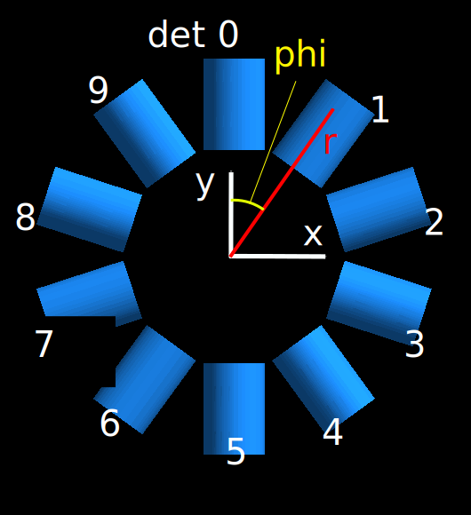
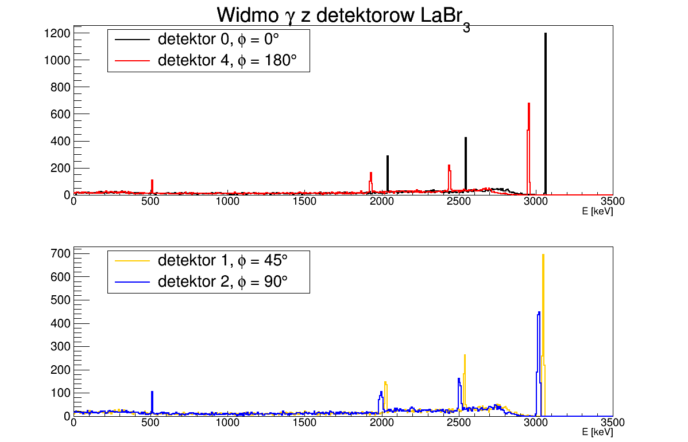

# PROJEKT ZALICZENIOWY Z PRZEDMIOTU ZASTOSOWANIA PAKIETU GEANT4 W FIZYCE JĄDROWEJ
## How to run it

1). Compilation

```bash
$ mkdir build
$ cd build
$ cmake .. && make

```
2). Running (in build directory)
```bash
$ ./LaBr3
```

Wyniki symulacji zapisywane są do drzewa o nazwie ```tree```. Drzewo to ma dwie gałęzie ```id``` oraz ```energy``` odpowiadające numerowi detektora i energii w nim zdeponowanej.
Drzewo zapisywane jest do pliku ```output.root```. W folderze ```results``` znajduje się makro ```compare_histograms.C```, które wczytuje plik output.root, generuje zestawienie widm detektorów i zapisuje je do pliku.
Przykładowe wyniki zamieszczono również poniżej.


## Cel projektu

Celem projektu było uzyskanie funkcji odpowiedzi układu detektorów LaBr3 rejestrującego promieniowanie gamma emitowane przez jon o określonej energii kinetycznej, tak aby zaobserwować efekt Dopplera.

## Geometria układu
Układ detektorów LaBr3 otacza radialnie punkt emisji promieniowania gamma. Ponieważ celem projektu jest badanie efektu Dopplera zdecydowano się rozmieścić detektory w tylko jednej płaszczyźnie (zagadnienie jest symetryczne).
Poniższa animacja przedstawia przykładową symulację (z widocznymi rozproszeniami Comptonowskimi) i rozmieszczenie detektorów w przestrzeni.


Natomiast dokładny opis geometrii wraz z numerami detektorów oraz przyjętym układem współrzędnych przedstawia rysunek poniżej. Wiązka jonów porusza się z parametrem ```beta``` wzdłuż osi y.




## Wyniki
Wyniki symulacji zamieszczono w folderze ```results```.



W obu przypadkach emitowany był kwant gamma o energii **3000 keV**. Na wszystkich widmach widoczne są piki ucieczki oraz linia 511 keV. Widać również przesunięcia dopplerowskie, a ich kierunek i wielkość odpowiada umiejscowieniu detektora w układzie.


## Author
Ewa Adamska

