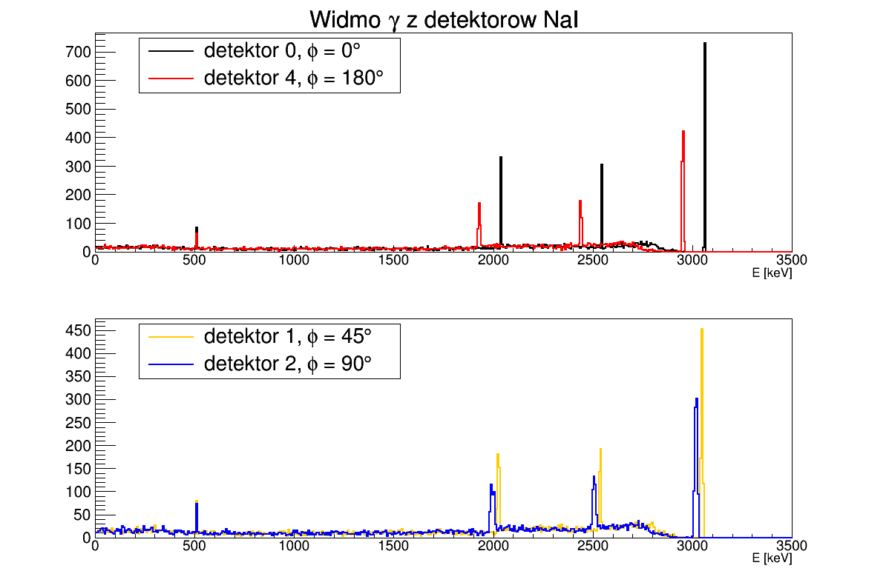

# PROJEKT ZALICZENIOWY Z PRZEDMIOTU ZASTOSOWANIA PAKIETU GEANT4 W FIZYCE JĄDROWEJ
## How to run it

## Cel projektu

Celem projektu było uzyskanie funkcji odpowiedzi układu detektorów LaBr3 rejestrującego promieniowanie gamma emitowane przez jon o określonej energii kinetycznej.

## Geometria układu
Geometrię wraz z numerami detektorów oraz przyjęty układ współrzędnych przedstawia rysunek.

## Wyniki
Wyniki symulacji zamieszczono w folderze '''results'''

## Author
Ewa Adamska

This project is licensed under the MIT License - see the [LICENSE.md](LICENSE.md) file for details
