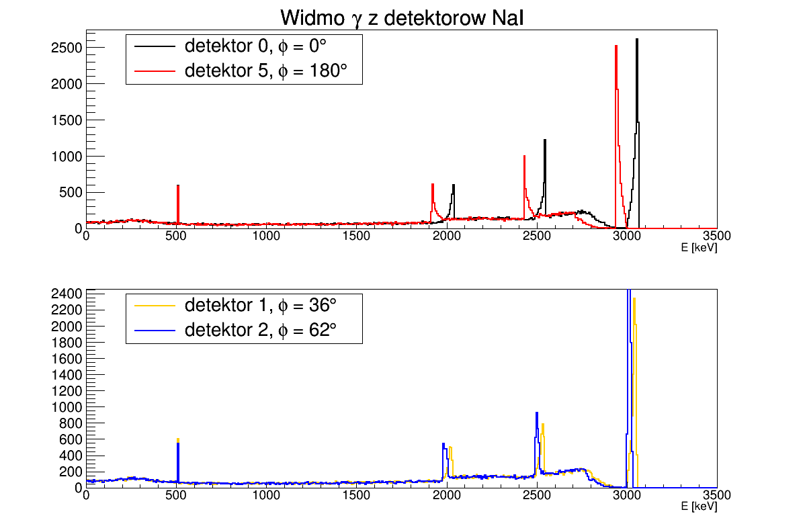
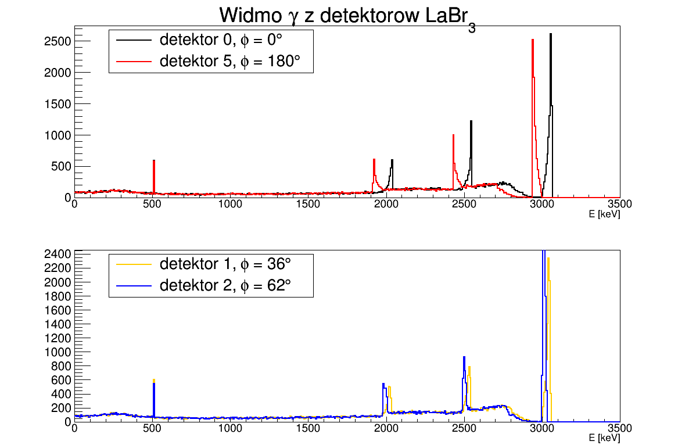

# PROJEKT ZALICZENIOWY Z PRZEDMIOTU ZASTOSOWANIA PAKIETU GEANT4 W FIZYCE JĄDROWEJ
## How to run it

1). Compilation

```bash
$ mkdir build
$ cd build
$ cmake .. && make

```
2). Running (in build directory)
```bash
$ ./LaBr3
```

## Cel projektu

Celem projektu było uzyskanie funkcji odpowiedzi układu detektorów LaBr3 rejestrującego promieniowanie gamma emitowane przez jon o określonej energii kinetycznej, tak aby zaobserwować efekt Dopplera.

## Geometria układu


Opis geometrii wraz z numerami detektorów oraz przyjętym układem współrzędnych przedstawia rysunek poniżej. Wiązka jonów porusza się z parametrem ```beta``` wzdłuż osi y.


## Wyniki
Wyniki symulacji zamieszczono w folderze results'''



## Author
Ewa Adamska


This project is licensed under the MIT License - see the [LICENSE.md](LICENSE.md) file for details
